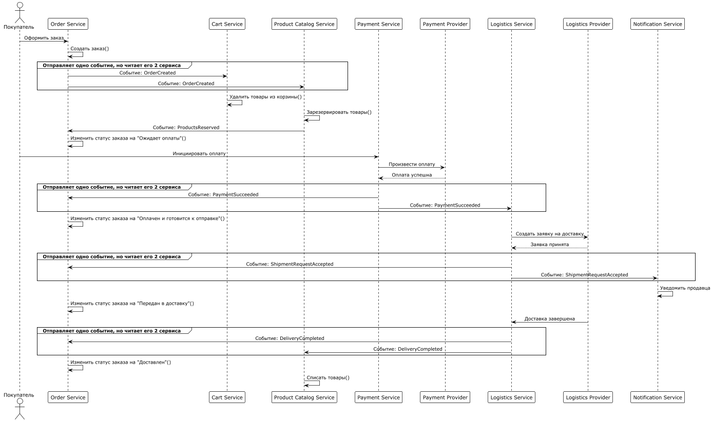
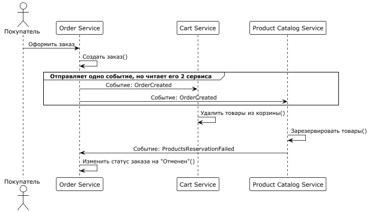
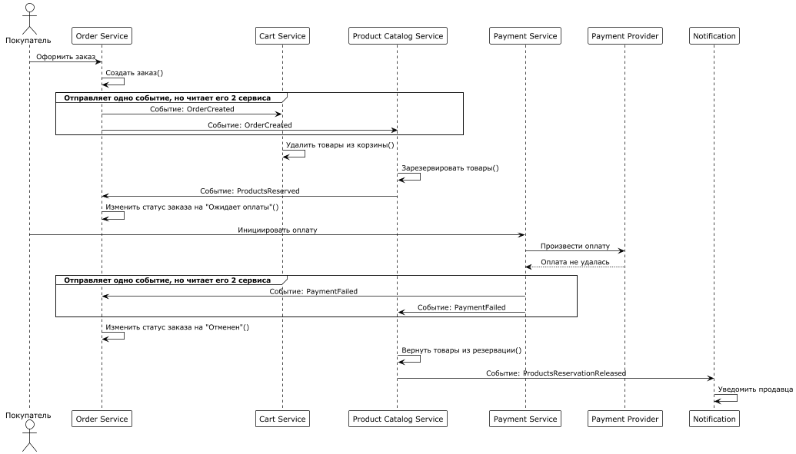
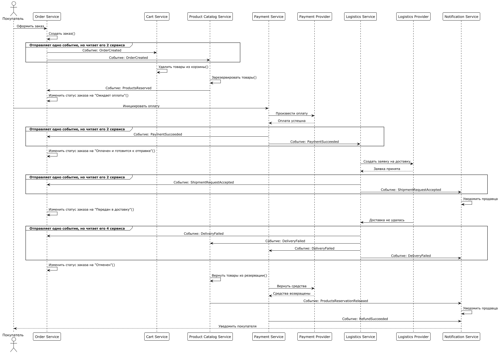

# Реестр событий Saga оформления заказа

## События

| Этап                            | Тип события | Название |
|---------------------------------| --- | --- |
| Заказ создан                    | domain | `OrderCreated` |
| Товары зарезервированы          | domain | `ProductsReserved` |
| Резервация товаров не удалась   | failure | `ProductsReservationFailed` |
| Оплата успешна                  | domain | `PaymentSucceeded` |
| Оплата не прошла                | failure | `PaymentFailed` |
| Заявка на доставку принята      | domain | `ShipmentRequestAccepted` |
| Доставка завершена              | domain | `DeliveryCompleted` |
| Доставка не удалась             | failure | `DeliveryFailed` |
| Товары возвращены из резервации | compensation | `ProductsReservationReleased` |
| Средства возвращены покупателю  | compensation | `RefundSucceeded` |

## Основной успешный сценарий

`OrderCreated` → `ProductsReserved` → `PaymentSucceeded` → `ShipmentRequestAccepted` → `DeliveryCompleted`

## Сценарии ошибок и компенсаций

### Ошибка резервации

`OrderCreated` → `ProductsReservationFailed`

Результат: заказ отменяется

### Ошибка оплаты

`OrderCreated` → `ProductsReserved` → `PaymentFailed`

Компенсация:

`PaymentFailed` → `ProductsReservationReleased`

Результат: заказ отменяется, зарезервированные товары освобождаются

### Ошибка доставки

`OrderCreated` → `ProductsReserved` → `PaymentSucceeded` → `ShipmentRequestAccepted` → `DeliveryFailed`

Компенсации:

- `DeliveryFailed` → `RefundSucceeded`
- `DeliveryFailed` → `ProductsReservationReleased`

Результат: заказ отменяется, средства возвращаются покупателю, зарезервированные товары освобождаются