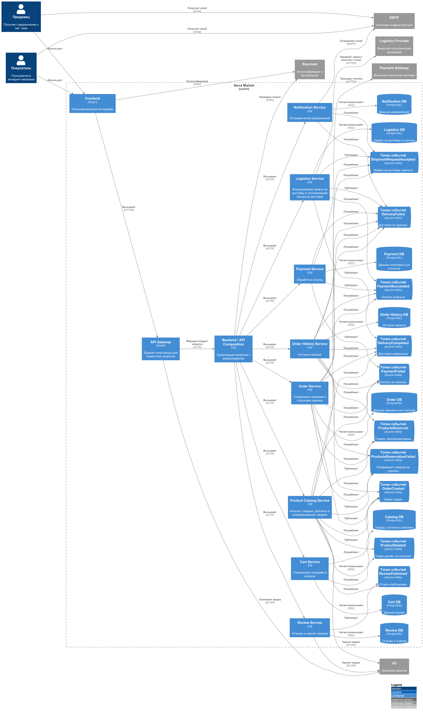

### **Название задачи:** Реализация просмотра истории покупок
### **Автор:** Ренев Д.Ю.
### **Дата:** 01.10.2026

### **Функциональные требования**
| **№** | **Действующие лица или системы** | **Use Case** | **Описание** |
|------:|---|---|---|
|     1 | Покупатель | Просмотр списка заказов | Покупатель просматривает список всех своих заказов с указанием стоимости, даты оформления и способа доставки |
|     2 | Покупатель | Просмотр подробной информации о заказе | Покупатель открывает заказ и просматривает список товаров, их количество и цену, итоговую сумму, способ доставки и оплаты, а также финальный статус заказа |
|     3 | Покупатель | Скачивание чека | Покупатель скачивает чек по выбранному заказу |
|     4 | Покупатель | Оставление отзыва о товаре | Покупатель оставляет отзыв о товаре, приобретённом в рамках заказа |
|     5 | Покупатель | Повторный заказ товара | Покупатель повторно заказывает товар из ранее оформленного заказа |

### **Нефункциональные требования**
| **№** | **Требование**                                                                                                                                                                                                       |
| :-: |:---------------------------------------------------------------------------------------------------------------------------------------------------------------------------------------------------------------------|
| 1 | История должна отображаться с приемлемым временем отклика даже при большом количестве заказов у пользователя                                                                                                         |
| 2 | Система должна поддерживать рост нагрузки примерно с 2 500+ заказов в день до 40 000+ заказов в день                                                                                                                 |

### **Решение**
Диаграмма контейнеров

Для реализации сценария просмотра истории заказов выбран подход CQRS в сочетании с API Composition, уже использовавшимся в архитектуре приложения.
В архитектуру добавляется отдельный контейнер Order History Service с собственной базой данных Order History DB. Этот сервис отвечает исключительно за read-модель, необходимую пользовательскому интерфейсу истории заказов.
Order History Service не является источником истины для заказов и не хранит полноценную доменную модель заказа. Он формирует денормализованную проекцию, содержащую только данные, необходимые для отображения истории и подробностей заказа.
Источниками событий для read-модели являются существующие микросервисы. Они публикуют изменения состояния заказа в Apache Kafka.
Order History Service подписан на соответствующие Kafka topics и на основании полученных событий создаёт или обновляет записи в собственной PostgreSQL базе данных.

Для чтения истории используется отдельный путь:
**Frontend → API Gateway → Order History Service → Order History DB.**

В отличие от исходного варианта, при запросе истории не требуется синхронно обращаться к Order Service, Product Catalog Service, Payment Service, Logistics Service и другим сервисам. Необходимые данные уже собраны в read-модели.
API Composition при этом сохраняется в архитектуре как существующий механизм агрегации данных для других пользовательских сценариев. Для истории заказов он дополняется CQRS.

#### Почему выбран CQRS
Главная причина выбора CQRS - характер нагрузки сценария.
История заказов является преимущественно ориентированным на чтение сценарием: пользователи часто просматривают уже существующие заказы, при этом изменение исторических данных происходит существенно реже, чем их чтение.

Если выполнять каждый запрос через API Composition, необходимо было бы каждый раз получать данные из нескольких сервисов и агрегировать их.
При росте количества заказов и пользовательской нагрузки такой подход приводит к большому количеству синхронных сетевых вызовов и увеличивает время ответа. Дополнительно отказ или задержка одного из сервисов может замедлить или сделать недоступным весь запрос истории.

CQRS позволяет перенести основную работу по агрегации данных из момента пользовательского запроса в момент обработки событий. Данные агрегируются заранее и сохраняются в формате, оптимизированном для чтения.
В результате запрос истории сводится к чтению подготовленной проекции из одной БД.

#### Роль API Composition
API Composition остаётся частью архитектуры приложения и используется для агрегации данных там, где это оправдано характером сценария.

#### Масштабирование

На начальном этапе ожидается около **2 500 заказов в день**, однако архитектура должна учитывать последующий рост до **40 000+ заказов в день**.
Kafka позволяет передавать события между сервисами асинхронно, а Order History Service может масштабироваться независимо от сервисов, отвечающих за создание и обработку заказов.
Order History DB также может оптимизироваться независимо от БД остальных сервисов: добавление индексов, изменение структуры read-модели, использование денормализации и другие оптимизации, без изменений модели данных сервисов-источников.

### **Альтернативы**
#### 1. API Composition без отдельного Order History Service
В качестве первого варианта можно было оставить существующую архитектуру и получать данные для истории непосредственно во время каждого запроса.
Frontend отправляет запрос в API Gateway, после чего API Composition синхронно обращается к нескольким сервисам и агрегирует их ответы.

**Плюсы:**
- не требуется новый сервис
- не требуется отдельная read-модель
- данные всегда читаются непосредственно из актуальных источников
- меньше компонентов в архитектуре
- отсутствует необходимость синхронизации read-модели с исходными данными

**Минусы:**
- один запрос истории требует нескольких сетевых вызовов
- увеличивается время ответа
- итоговое время ответа зависит от самого медленного сервиса
- при большом количестве заказов становится дорого агрегировать данные на каждый запрос
- высокая нагрузка на Order Service, Payment Service, Logistics Service и другие сервисы
- усложняется масштабирование чтения
- отказ одного из участвующих сервисов может повлиять на отображение всей истории

При ожидаемом росте нагрузки до 40 000+ заказов в день этот вариант не обеспечивает требуемой оптимизации чтения.

#### 2. Event Sourcing
Другой возможный вариант - построить историю заказов непосредственно на основе Event Sourcing, сохраняя последовательность событий как основной источник состояния.

**Плюсы:**
- полная история изменений состояния агрегата
- возможность восстановить состояние объекта на определённый момент времени
- события являются источником истины
- удобно анализировать последовательность изменений состояния

**Минусы:**
- существенно увеличивается сложность архитектуры
- необходимо проектировать и поддерживать event store
- усложняется восстановление состояния
- необходимо учитывать версионирование событий и изменение схем событий
- для простого сценария быстрого отображения истории заказов возможности Event Sourcing избыточны
- Event Sourcing сам по себе не решает задачу оптимизированного чтения - для быстрого UI всё равно может потребоваться отдельная проекция

Поэтому Event Sourcing не выбран: бизнес-требование заключается прежде всего в быстром чтении истории, а не в необходимости хранить полный event log как основной источник истины.

**Сравнение решений**

| Критерий | API Composition без отдельного сервиса | Event Sourcing | CQRS + Order History Service                                                                  |
|---|---|---|-----------------------------------------------------------------------------------------------|
| Время отклика на чтение истории | ⚠️ Несколько синхронных вызовов на каждый запрос, итоговое время зависит от самого медленного сервиса | ⚠️ Ускоряет запись состояния, но для быстрого UI всё равно требуется отдельная проекция | ✅ Чтение заранее собранной денормализованной проекции из одной БД                            |
| Масштабируемость при росте до 40 000+ заказов/день | ❌ Нагрузка растёт вместе с сервисами записи, агрегация данных на каждый запрос становится дорогой | ✅ Append-only журнал событий хорошо масштабируется | ✅ Сервис и его БД масштабируются независимо от сервисов записи                               |
| Устойчивость к отказам сервисов-источников | ❌ Отказ или задержка одного из сервисов ломает отображение всей истории | ✅ Чтение отделено от сервисов-источников | ✅ Чтение отделено от источников, проекция уже подготовлена                                   |
| Актуальность данных в интерфейсе | ✅ Данные читаются из источников в реальном времени | ⚠️ Eventual consistency при построении проекции | ⚠️ Eventual consistency: между изменением заказа и его появлением в истории возможна задержка |
| Простота реализации | ✅ Новый сервис и отдельная read-модель не требуются | ❌ Требуются event store, версионирование и обработка событий | ⚠️ Требуются новый сервис, БД и обработка событий, но заметно проще Event Sourcing            |
| Операционная сложность и стоимость сопровождения | ✅ Дополнительные компоненты не появляются | ❌ Дополнительный event store и сложная эксплуатация | ⚠️ Дополнительный сервис и PostgreSQL БД, требующие обслуживания и мониторинга                |
| Гибкость и эволюция модели чтения | ❌ Модель ограничена контрактами сервисов-источников | ⚠️ Гибко для анализа изменений, но не оптимизировано под UI | ✅ Денормализованная проекция развивается под UI независимо от источников                     |
| Дублирование данных | ✅ Дублирования нет | ⚠️ Часть данных дублируется в проекциях | ❌ Данные присутствуют и в БД источников, и в read-модели                                     |

**Резюме** 

Выбран вариант CQRS + Order History Service, потому что он единственный обеспечивает требуемое время отклика и масштабируемость чтения истории при росте до 40 000+ заказов в день: 
данные агрегируются заранее в денормализованную проекцию, а сервис и его БД масштабируются независимо от сервисов записи. 
Его компромиссы — eventual consistency, дополнительный сервис с отдельной БД и дублирование данных — для сценария просмотра истории приемлемы. 
API Composition не выдерживает целевую нагрузку и зависит от доступности всех сервисов-источников, а Event Sourcing избыточен по сложности и сам по себе не решает задачу быстрого чтения.

**Недостатки, ограничения, риски**
1. **Eventual consistency.**  
   Read-модель обновляется асинхронно. Поэтому между изменением состояния заказа и появлением изменения в истории может существовать небольшая задержка. Пользователь потенциально может некоторое время видеть предыдущее состояние заказа.
2. **Сложность обработки событий.**  
   Order History Service должен корректно обрабатывать повторную доставку событий, возможное нарушение порядка их обработки и повторное построение проекции.
3. **Дополнительное хранилище.**  
   Появляется отдельная PostgreSQL база Order History DB, которую необходимо обслуживать, резервировать и мониторить.
4. **Необходимость восстановления read-модели.**  
   При повреждении или удалении Order History DB должна существовать возможность восстановить проекцию из доступных событий Kafka либо другим предусмотренным механизмом.
5. **Дублирование данных.**  
   Некоторые данные о заказах присутствуют одновременно в БД исходных сервисов и в read-модели Order History Service. Это осознанная цена за оптимизацию чтения.
6. **Изменение формата событий.**  
   Изменения контрактов Kafka events должны выполняться совместимо с существующими consumers, включая Order History Service.
7. **Увеличение количества компонентов.**  
   По сравнению с API Composition без CQRS появляется дополнительный сервис и дополнительная БД. Это увеличивает операционную и архитектурную сложность.

Несмотря на эти ограничения, выбранный подход позволяет отделить модель чтения от моделей записи и заранее подготовить данные для наиболее критичного требования сценария - быстрого отображения истории заказов при росте количества заказов и пользовательской нагрузки.
